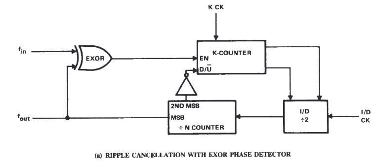
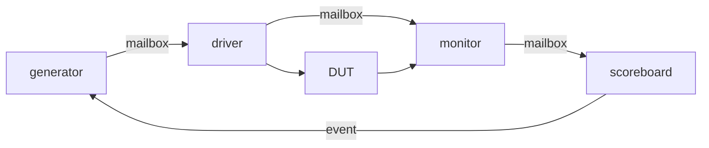

# DPLL
A simple SystemVerilog digital phase-locked loop based (roughly) on TI's [SDLA005B](http://www.ti.com/lit/an/sdla005b/sdla005b.pdf) application note. The design includes a SystemVerilog testbench demonstrating a full generator, driver, monitor, and scoreboard testbench environment.

# DUT: DPLL Design Description
## Figure 5 from SDLA005B (page 4) 


I originally implemented this DPLL when I needed to lock onto a very slow (kHz range) reference signal and run some logic at phase-locked, faster clock. As implemented here, the input sync signal (clk_fin) is running at 390.625 kHz and the main output clock is clk8x_fout (3.125 MHz). Since the MMCM and PLL's inside Xilinx FPGAs usually require input clocks faster than one or more **tens** of MHz, a custom logic design was needed.

I've been working to improve my testbench writing skills lately, so I decided to resurrect this old design. Since I couldn't remember the lock ranges that I was able to achieve years ago, I decided to use a modern testbench environment to characterize the design.

# Testbench


The testbench waits 490 clocks for the dpll output to settle, captures 10 clk_fout cycles, and calculates the average clk_fout frequency. It also calculates the phase difference between fout and fin. Using a constraint on fin's frequency, I increased the error range until I saw a few mismatches using short runs and settled on a test range of +/- 200 Hz (5.12 ppm).

## Short Test Run to Set Frequency Constraint
```console
[DRV] RESET DONE
-----------------------------------------------------------------------------------------------------
[GEN] fin:  390809 Hz     fout:       0 Hz   0 degrees  (from fin)     fout8x:       0 Hz
[DRV] fin:  390809 Hz     fout:       0 Hz   0 degrees  (from fin)     fout8x:       0 Hz
[DRV] fin_period: 2559
[MON] 2429, 131
[MON] fin:  390809 Hz     fout:  390930 Hz  18 degrees  (from fin)     fout8x:       0 Hz
[SCO] fin:  390809 Hz     fout:  390930 Hz  18 degrees  (from fin)     fout8x:       0 Hz
[SCO] DATA MISMATCHED
-----------------------------------------------------------------------------------------------------
[GEN] fin:  390678 Hz     fout:       0 Hz   0 degrees  (from fin)     fout8x:       0 Hz
[DRV] fin:  390678 Hz     fout:       0 Hz   0 degrees  (from fin)     fout8x:       0 Hz
[DRV] fin_period: 2560
[MON] 10, 2550
[MON] fin:  390678 Hz     fout:  390625 Hz  -1 degrees  (from fin)     fout8x:       0 Hz
[SCO] fin:  390678 Hz     fout:  390625 Hz  -1 degrees  (from fin)     fout8x:       0 Hz
[SCO] DATA MATCHED
-----------------------------------------------------------------------------------------------------
[GEN] fin:  390603 Hz     fout:       0 Hz   0 degrees  (from fin)     fout8x:       0 Hz
[DRV] fin:  390603 Hz     fout:       0 Hz   0 degrees  (from fin)     fout8x:       0 Hz
[DRV] fin_period: 2560
[MON] 10, 2550
[MON] fin:  390603 Hz     fout:  390625 Hz  -1 degrees  (from fin)     fout8x:       0 Hz
[SCO] fin:  390603 Hz     fout:  390625 Hz  -1 degrees  (from fin)     fout8x:       0 Hz
[SCO] DATA MATCHED
-----------------------------------------------------------------------------------------------------
[GEN] fin:  390530 Hz     fout:       0 Hz   0 degrees  (from fin)     fout8x:       0 Hz
[DRV] fin:  390530 Hz     fout:       0 Hz   0 degrees  (from fin)     fout8x:       0 Hz
[DRV] fin_period: 2561
[MON] 10, 2550
[MON] fin:  390530 Hz     fout:  390625 Hz  -1 degrees  (from fin)     fout8x:       0 Hz
[SCO] fin:  390530 Hz     fout:  390625 Hz  -1 degrees  (from fin)     fout8x:       0 Hz
[SCO] DATA MATCHED
-----------------------------------------------------------------------------------------------------
[GEN] fin:  390798 Hz     fout:       0 Hz   0 degrees  (from fin)     fout8x:       0 Hz
[DRV] fin:  390798 Hz     fout:       0 Hz   0 degrees  (from fin)     fout8x:       0 Hz
[DRV] fin_period: 2559
[MON] 2429, 131
[MON] fin:  390798 Hz     fout:  390930 Hz  18 degrees  (from fin)     fout8x:       0 Hz
[SCO] fin:  390798 Hz     fout:  390930 Hz  18 degrees  (from fin)     fout8x:       0 Hz
[SCO] DATA MISMATCHED
-----------------------------------------------------------------------------------------------------
[GEN] fin:  390594 Hz     fout:       0 Hz   0 degrees  (from fin)     fout8x:       0 Hz
[DRV] fin:  390594 Hz     fout:       0 Hz   0 degrees  (from fin)     fout8x:       0 Hz
[DRV] fin_period: 2560
[MON] 10, 2550
[MON] fin:  390594 Hz     fout:  390625 Hz  -1 degrees  (from fin)     fout8x:       0 Hz
[SCO] fin:  390594 Hz     fout:  390625 Hz  -1 degrees  (from fin)     fout8x:       0 Hz
[SCO] DATA MATCHED
-----------------------------------------------------------------------------------------------------
[GEN] fin:  390470 Hz     fout:       0 Hz   0 degrees  (from fin)     fout8x:       0 Hz
[DRV] fin:  390470 Hz     fout:       0 Hz   0 degrees  (from fin)     fout8x:       0 Hz
[DRV] fin_period: 2561
[MON] 10, 2550
[MON] fin:  390470 Hz     fout:  390625 Hz  -1 degrees  (from fin)     fout8x:       0 Hz
[SCO] fin:  390470 Hz     fout:  390625 Hz  -1 degrees  (from fin)     fout8x:       0 Hz
[SCO] DATA MATCHED
-----------------------------------------------------------------------------------------------------
[GEN] fin:  390526 Hz     fout:       0 Hz   0 degrees  (from fin)     fout8x:       0 Hz
[DRV] fin:  390526 Hz     fout:       0 Hz   0 degrees  (from fin)     fout8x:       0 Hz
[DRV] fin_period: 2561
[MON] 10, 2550
[MON] fin:  390526 Hz     fout:  390625 Hz  -1 degrees  (from fin)     fout8x:       0 Hz
[SCO] fin:  390526 Hz     fout:  390625 Hz  -1 degrees  (from fin)     fout8x:       0 Hz
[SCO] DATA MATCHED
-----------------------------------------------------------------------------------------------------
[GEN] fin:  390446 Hz     fout:       0 Hz   0 degrees  (from fin)     fout8x:       0 Hz
[DRV] fin:  390446 Hz     fout:       0 Hz   0 degrees  (from fin)     fout8x:       0 Hz
[DRV] fin_period: 2561
[MON] 10, 2550
[MON] fin:  390446 Hz     fout:  390625 Hz  -1 degrees  (from fin)     fout8x:       0 Hz
[SCO] fin:  390446 Hz     fout:  390625 Hz  -1 degrees  (from fin)     fout8x:       0 Hz
[SCO] DATA MATCHED
-----------------------------------------------------------------------------------------------------
[GEN] fin:  390794 Hz     fout:       0 Hz   0 degrees  (from fin)     fout8x:       0 Hz
[DRV] fin:  390794 Hz     fout:       0 Hz   0 degrees  (from fin)     fout8x:       0 Hz
[DRV] fin_period: 2559
[MON] 2429, 131
[MON] fin:  390794 Hz     fout:  390930 Hz  18 degrees  (from fin)     fout8x:       0 Hz
[SCO] fin:  390794 Hz     fout:  390930 Hz  18 degrees  (from fin)     fout8x:       0 Hz
[SCO] DATA MISMATCHED
```