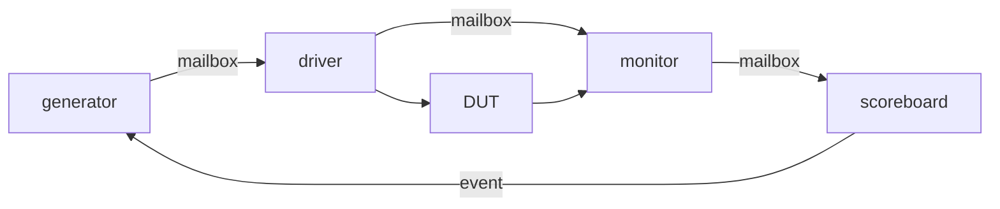

# DPLL

A simple SystemVerilog digital phase-locked loop based (roughly) on TI's [SDLA005B](http://www.ti.com/lit/an/sdla005b/sdla005b.pdf) application note. The design includes a SystemVerilog testbench demonstrating a full generator, driver, monitor, and scoreboard testbench environment.

# DUT: DPLL Design Description
## Figure 5 from SDLA005B (page 4) 

I originally implemented this DPLL when I needed to lock onto a very slow (kHz range) reference signal and run some logic at phase-locked, faster clock. As implemented here, the input sync signal (clk_fin) is running at 390.625 kHz and the main output clock is clk8x_fout (3.125 MHz). Since the MMCM and PLL's inside Xilinx FPGAs usually require input clocks faster than one or more **tens** of MHz, a custom logic design was needed.

I've been working to improve my testbench writing skills lately, so I decided to resurrect this old design. Since I couldn't remember the lock ranges that I was able to achieve years ago, I decided to use a modern testbench environment to characterize the design.

# Testbench

The testbench waits 490 clocks for the dpll output to settle, captures 10 clk_fout cycles, and calculates the average clk_fout frequency.