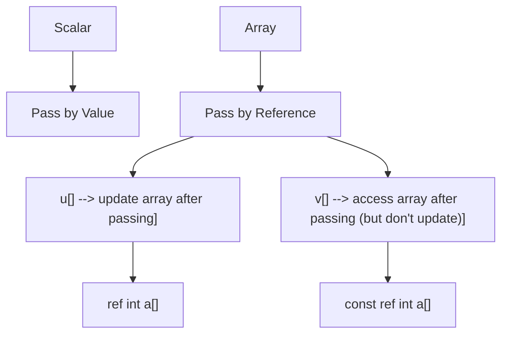
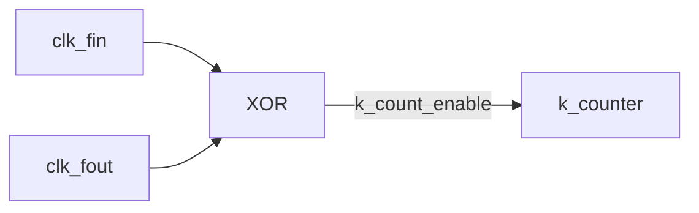

# DPLL

A simple SystemVerilog digital phase-locked loop based (roughly) on TI's [SDLA005B](http://www.ti.com/lit/an/sdla005b/sdla005b.pdf) application note. The design includes a SystemVerilog testbench demonstrating a full generator, driver, monitor, and scoreboard testbench environment.

# DUT: DPLL Design Description

